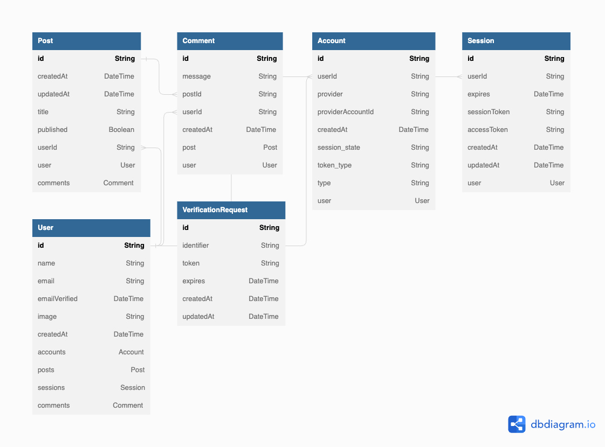

# Tiny Post App

* live demo <a href="https://tiny-post-app.vercel.app/" target="_blank" rel="noopener">here</a>

## Introduction

A Blog App built with Next.js 13, React Query, TypeScript and Sass as frontend and Prisma and PostgreSQl(hosted on Railway) as backend.

## 🗝️ Features

* Built with Next.js 13's new feature "app" directory
* Sign in with google account using NextAuth/OAuth
* Create database(postgreSQL) models with prisma schema
* Implement CRUD using React Query and Axios
    - user can Create, Read, Update and Delete their posts
    - user can add comments to any posts
* Error handling with useMutation hook + react hot toast
* Use Sass modules throuout the app
* Use Sass mixins and variables for reusable styles
* Add notification using react hot toast
 - loading, error, success
* Completely responsive 🙌

## 📀 Database Schema

## 📸 Screenshots

## 🛠️ Tech Stack

## Dependencies
* React-Hot-Toast
* Axios
* Prisma
## 🔜 Future Challenge
- [ ] Testing app 
- [ ] Add other authO options for sign in